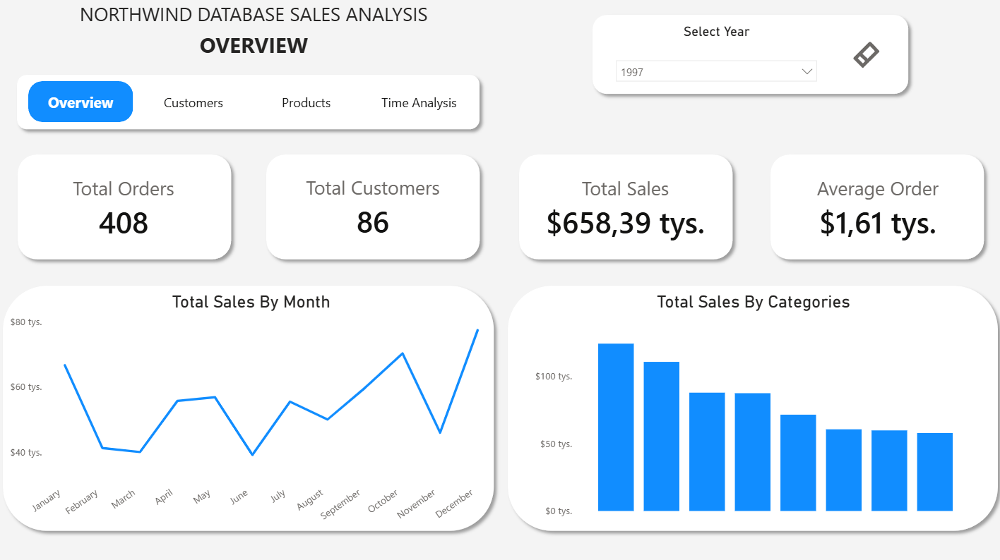
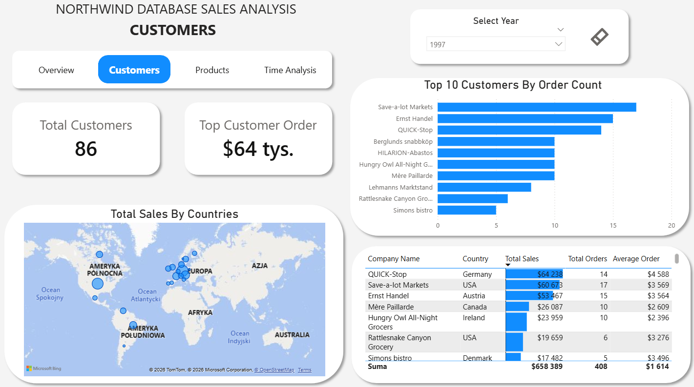
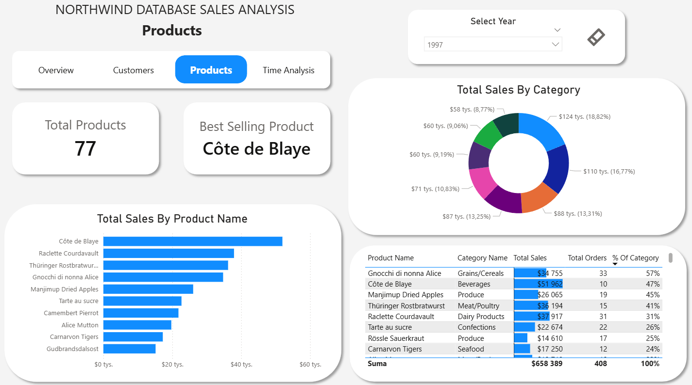
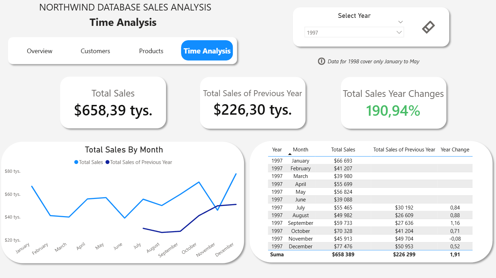
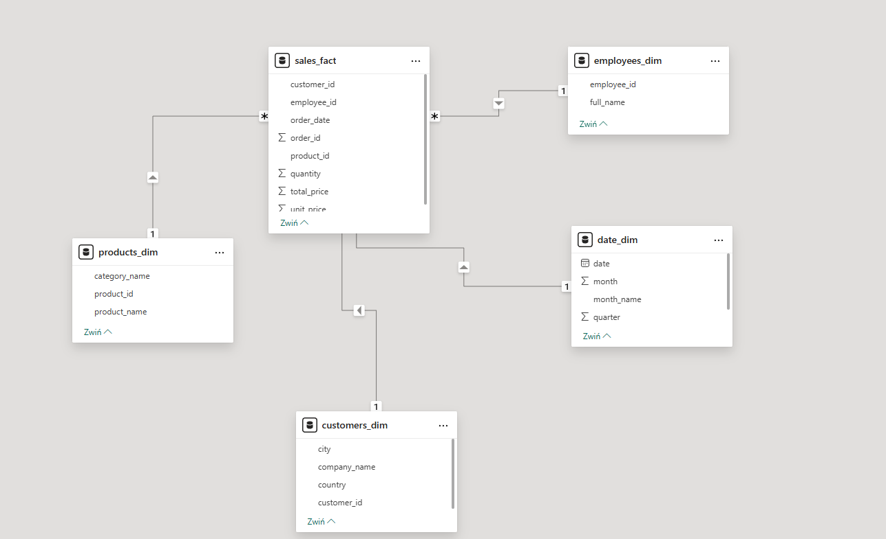

# Northwind Sales Dashboard - Power BI

Interaktywny dashboard sprzedażowy zbudowany na bazie danych Northwind, przedstawiający wyniki sprzedaży, analizę klientów, produktów oraz trendów czasowych.

---

## Podgląd

### Overview

### Customers

### Products

### Time Analysis

---

## Strony dashboardu

**1. Overview** - ogólne podsumowanie wyników firmy: łączna sprzedaż, liczba zamówień, klientów oraz trend miesięczny.

**2. Customers** - analiza klientów: mapa sprzedaży według krajów, top 10 klientów oraz tabela z formatowaniem warunkowym.

**3. Products** - analiza produktów i kategorii: udziały procentowe kategorii, top 10 produktów oraz szczegółowa tabela produktów.

**4. Time Analysis** - analiza czasowa: porównanie sprzedaży rok do roku (YoY), trend miesięczny oraz tabela miesięczna.

---

## Źródło danych

Dane pochodzą z lokalnej bazy **PostgreSQL** zawierającej dataset Northwind - przykładową bazę danych reprezentującą operacje sprzedażowe fikcyjnej firmy handlowej.

Dane zostały zaimportowane do Power BI za pomocą własnych zapytań SQL tworzących model w schemacie gwiazdy (star schema).

